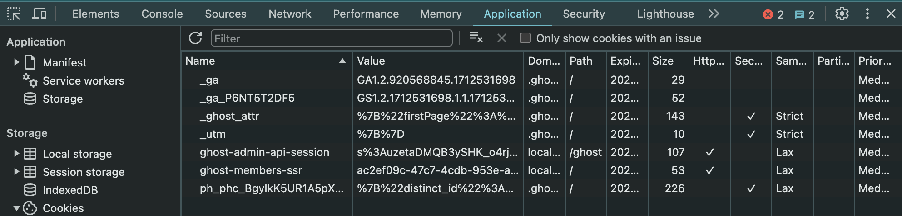

# RIPuppet
Version Modificada de RIPuppet para correr sobre Ghost

# Requesitos para ejecutar:
1. Tener instalado Ghost y haber creado un blog de Ghost
2. Node 18 o mayor


# Como Ejecutar:
1. Correr Ghost de manera local, y crear un blog o inicar sesion.
2. Obtener Cookie de session de Ghost. Esta con el nombre de `ghost-admin-api-session` (Para esto abra inspeccionar elemento en el navegador, vaya a almacenamiento, cookies y seleccione Cookies)

3. En el archivo `config.json`, actualiza el valor de sessionCookie de acuerdo a la info que se obtuvo del navegador.
4. Corra el comando:
```bash
yarn start #npm run start 
```
5. Si hay un error al ejecutar el comando, puede ser por que se necesite algunas cosas de PlayWright, corra el siguiente comando:
```bash
yarn playwright install  # npx playwright install
```